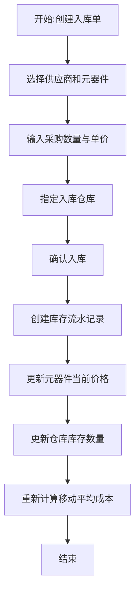
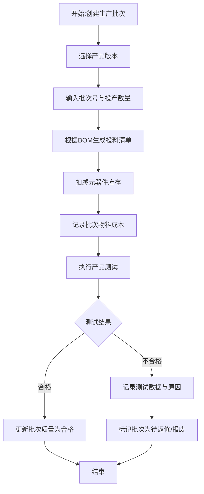
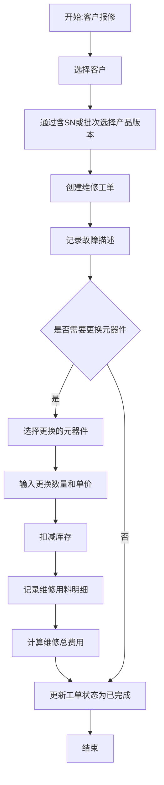
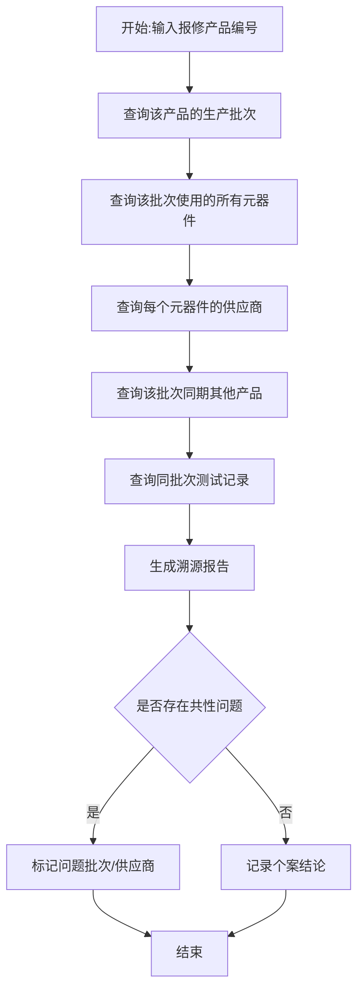
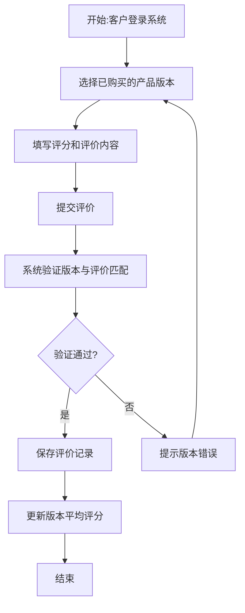

 **硬件产品全生命周期管理系统（HPLM）**

**项目背景**：我在大一大二打硬件赛的时候，经常要做PCB Layout，其中就大量涉及到元器件选型（电容、电阻、电感、MCU、Soc、DSP、FPGA等等选型）、参数检索（例如封装、耐压、防水防尘等级）、实现功能（元器件有哪些功能，可以满足我的什么需求）……当元器件一多，单凭记忆和原理图注释很难管理，因此就涉及了一款硬件产品全生命周期管理系统。该系统支持录入元器件参数、采购信息管理，同时还对接真实硬件产品研发记录管理需求，支持记录所用元器件、研发人员记录、版本管理、对接客户等等需求（项目背景这块需要你继续完善）

**文字描述**：项目经理或研发工程师进入BOM配置界面，首先选择需要配置的产品版本（如产品A v2.0）。系统展示该版本当前的BOM清单。用户可以执行三种操作：添加元器件（从元器件库中搜索选择，输入用量和PCB位置）、修改用量、删除元器件。每次操作后保存BOM记录，系统自动根据BOM中元器件的最新采购价重新计算该版本的单台预估物料成本，并更新到产品版本表中，为定价决策提供依据。

### 功能2：元器件采购入库流程



**文字描述**：采购人员收到元器件到货后，在系统中创建入库单。首先选择供应商和元器件，输入采购数量、单价以及要入库的仓库。确认入库后，系统自动完成三件事：1）在库存流水表中插入入库记录；2）将元器件表的当前采购价格更新为最新单价；3）增加对应仓库的库存数量，并基于移动平均法重新计算库存平均成本。此流程确保采购数据可追溯，为产品成本核算提供准确的物料成本基准。

### 功能3：产品生产与测试流程



**文字描述**：生产人员创建生产批次，选择要生产的产品版本（如产品A v2.0），输入批次号和计划投产数量。系统自动根据该版本BOM生成投料清单，并扣减各元器件在指定仓库的库存。系统计算本次批次的物料总成本（各元器件用量×当前单价）。生产完成后，测试人员对产品执行测试，记录测试项目、测试结果和测试数据。如果测试合格，批次质量状态标记为“合格”；如果不合格，标记为“待返修”或“报废”，并记录详细测试数据供质量分析使用。

### 功能4：售后维修与换料追溯流程



**文字描述**：维修工程师接到客户报修后，在系统中创建维修工单。首先选择或新增客户信息，然后选择送修的产品版本（可通过产品序列号或生产批次定位）。录入故障描述后，如果维修过程中需要更换元器件，从元器件库中选择更换的元器件，输入数量和当时的单价（可手动输入或取当前库存价），系统自动扣减对应仓库库存并记录维修用料明细。所有用料确认后，系统计算维修总费用（包含人工费和换料费）。工单完成后状态更新为“已完成”，所有维修换料记录可追溯，支持统计维修成本和分析产品故障原因。

### 功能5：故障产品元器件溯源流程



**文字描述**：质量工程师或项目经理在收到产品故障报告后，进入溯源分析功能。输入故障产品的编号（或序列号/批次号），系统自动执行如下查询链：1）查找该产品所属的生产批次；2）通过批次投料表查询该批次使用了哪些元器件及用量；3）通过元器件关联查询每个元器件的供应商信息；4）查找同批次生产的其他产品列表及它们的测试记录。系统综合以上信息生成完整的溯源报告。如果发现同批次多个产品存在相似故障或使用了来自同一供应商的同一批次元器件，工程师可以标记该批次或供应商存在问题，触发进一步的质量审查流程。此流程是系统的核心价值体现，实现了“故障产品→生产批次→元器件→供应商”的完整追溯。

### 功能6：客户评价与版本反馈流程（补充）



**文字描述**：客户登录系统后，在“我的产品”页面选择已购买的具体产品版本（如产品A v2.0），填写1-5星的评分和文字评价内容。提交时系统会校验该评价关联的产品版本是否正确，确保v1.0版本的评价不会被错误归到v2.0版本。评价保存成功后，系统自动更新该产品版本的平均评分和评价总数，便于项目经理了解不同版本的真实市场反馈，辅助产品改进决策。

```

```
