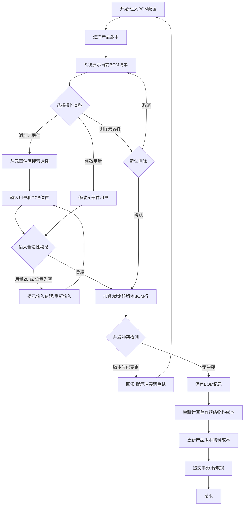
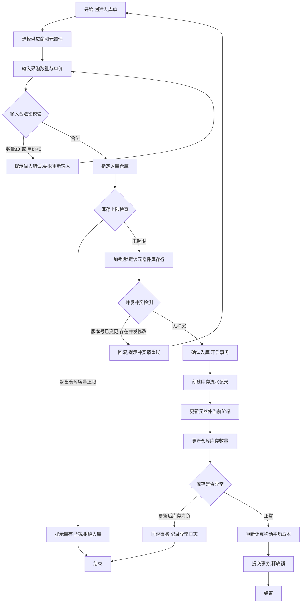
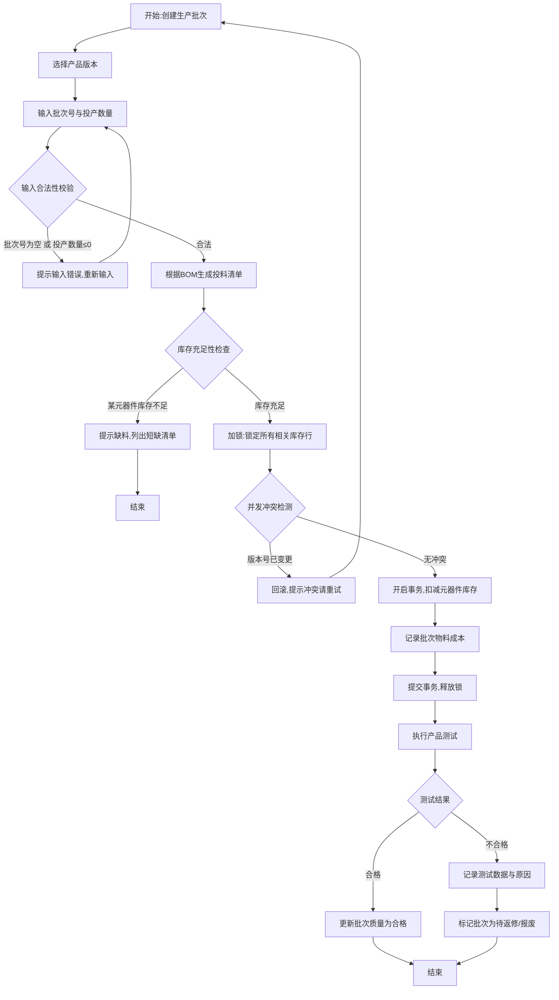
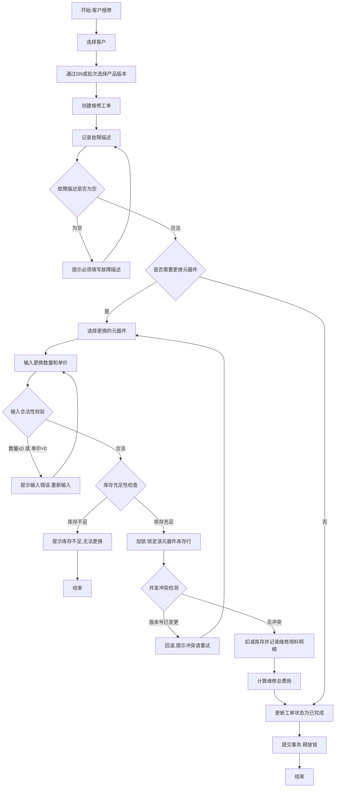
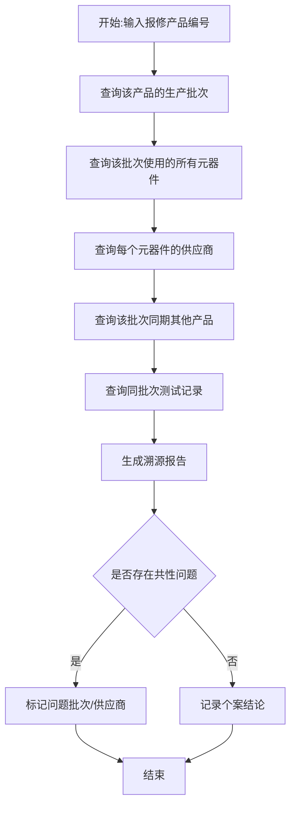
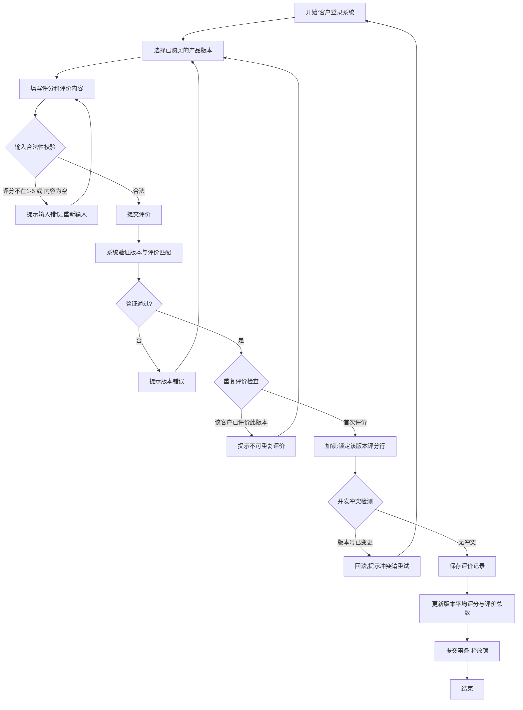

# 硬件产品全生命周期管理系统（HPLM）

## 应用场景

本系统面向硬件产品研发团队，由本人从大一打比赛时的硬件作品版本控制痛点、元器件管理费时费力痛点中启发诞生，可解决硬件产品从元器件选型、采购入库、BOM配置、生产批次管理到售后维修的全生命周期管理问题。在本人或其他团队的硬件开发过程中（如PCB Layout），我们研发人员需要大量进行元器件选型（电容、电阻、电感、MCU、SoC、DSP、FPGA等）、参数检索（封装、耐压、防水防尘等级等）以及功能匹配。当元器件数量增多后，单凭记忆和原理图注释很难高效管理。本系统支持录入元器件参数、采购信息管理，同时对接真实硬件产品研发记录管理需求，支持记录所用元器件、研发人员记录、版本管理、对接客户等需求。

- **目标用户**:硬件研发工程师、项目经理、采购人员、生产测试人员、维修工程师、质量工程师、客户
- **核心业务**:元器件全生命周期管理、BOM物料清单配置、采购入库与库存管理、产品生产批次与测试管理、售后维修追溯、客户反馈管理

## 功能列表

| 功能名称      | 功能简述                                    |
| --------- | --------------------------------------- |
| 元器件信息管理   | 录入和维护元器件的基本参数（封装、耐压、精度等）、功能特性，支持按条件检索筛选 |
| 供应商管理     | 管理元器件供应商信息，包括供应商名称、联系方式、供货元器件关联等        |
| BOM物料清单配置 | 为不同产品版本配置物料清单，添加/修改/删除元器件及用量，自动计算物料成本   |
| 元器件采购入库   | 创建采购入库单，更新库存和元器件当前价格，基于移动平均法计算库存成本      |
| 产品生产与测试   | 创建生产批次，根据BOM自动生成投料清单并扣减库存，记录测试结果和质量状态   |
| 售后维修与换料追溯 | 创建维修工单，记录故障描述和更换元器件明细，自动扣减库存并计算维修费用     |
| 故障产品元器件溯源 | 从故障产品追溯生产批次、所用元器件和供应商，生成溯源报告            |
| 客户评价与版本反馈 | 客户对已购买产品版本进行评分和评价，系统自动更新版本平均评分          |

## 核心业务流程

### 功能1：BOM物料清单配置

**文字描述**：项目经理或研发工程师进入BOM配置界面，首先选择需要配置的产品版本（如产品A v2.0）。系统展示该版本当前的BOM清单。用户可以执行三种操作：添加元器件（从元器件库中搜索选择，输入用量和PCB位置）、修改用量、删除元器件。每次操作前系统进行输入合法性校验（用量必须大于0，PCB位置不能为空），不合法则提示重新输入。校验通过后对该版本BOM行加行级锁，检测是否存在并发修改冲突——若同一版本正被其他工程师编辑则回滚并提示重试。无冲突后保存BOM记录，系统自动根据BOM中元器件的最新采购价重新计算该版本的单台预估物料成本，更新到产品版本表中，最后提交事务释放锁。

### 功能2：元器件采购入库

**文字描述**：采购人员收到元器件到货后，在系统中创建入库单。首先选择供应商和元器件，输入采购数量、单价以及要入库的仓库。系统先对输入进行合法性校验（数量必须大于0，单价不能为负），不合法则提示重新输入。接着检查目标仓库是否已满（超出容量上限则拒绝入库）。通过后系统对该元器件库存行加行级锁，并检测版本号是否被其他并发事务修改——若存在冲突则回滚并提示重试。确认无冲突后，在事务内依次完成：1）插入库存流水记录；2）更新元器件当前采购价格；3）增加仓库库存数量。若更新后库存为负（异常情况），回滚事务并记录异常日志；正常则基于移动平均法重新计算库存平均成本，提交事务释放锁。此流程通过输入校验、容量检查、并发锁和事务保护，确保采购数据的安全性与可追溯性。

### 功能3：产品生产与测试

**文字描述**：生产人员创建生产批次，选择要生产的产品版本（如产品A v2.0），输入批次号和计划投产数量。系统首先校验输入合法性（批次号不能为空，投产数量必须大于0）。然后根据该版本BOM自动生成投料清单，并检查各元器件库存是否充足——若某元器件库存不足则提示缺料并列出短缺清单，终止操作。库存充足后，系统对所有相关库存行加行级锁，检测并发冲突。无冲突则在事务内批量扣减库存并记录批次物料总成本（各元器件用量×当前单价），提交事务释放锁。生产完成后，测试人员对产品执行测试，记录测试项目、测试结果和测试数据。如果测试合格，批次质量状态标记为"合格"；如果不合格，标记为"待返修"或"报废"，并记录详细测试数据供质量分析使用。

### 功能4：售后维修与换料追溯

**文字描述**：维修工程师接到客户报修后，在系统中创建维修工单。首先选择或新增客户信息，然后选择送修的产品版本（可通过产品序列号或生产批次定位）。录入故障描述时系统校验不能为空。如果维修过程中需要更换元器件，从元器件库中选择更换的元器件，输入数量和当时的单价——系统校验数量必须大于0且单价不能为负，不合法则提示重新输入；同时检查库存是否充足，不足则提示无法更换。校验通过后对该元器件库存行加行级锁并做并发冲突检测，若存在并发修改则回滚提示重试。无冲突后扣减对应仓库库存并记录维修用料明细，计算维修总费用（包含人工费和换料费），更新工单状态为"已完成"，最后提交事务释放锁。

### 功能5：故障产品元器件溯源

**文字描述**：质量工程师或项目经理在收到产品故障报告后，进入溯源分析功能。输入故障产品的编号（或序列号/批次号），系统自动执行如下查询链:1）查找该产品所属的生产批次；2）通过批次投料表查询该批次使用了哪些元器件及用量；3）通过元器件关联查询每个元器件的供应商信息；4）查找同批次生产的其他产品列表及它们的测试记录。系统综合以上信息生成完整的溯源报告。如果发现同批次多个产品存在相似故障或使用了来自同一供应商的同一批次元器件，工程师可以标记该批次或供应商存在问题，触发进一步的质量审查流程。此流程是系统的核心价值体现，实现了"故障产品→生产批次→元器件→供应商"的完整追溯。

### 功能6：客户评价与版本反馈

**文字描述**：客户登录系统后，在"我的产品"页面选择已购买的具体产品版本（如产品A v2.0），填写1-5星的评分和文字评价内容。系统首先校验输入合法性（评分必须在1-5之间，评价内容不能为空）。提交时系统校验该评价关联的产品版本是否正确，确保v1.0版本的评价不会被错误归到v2.0版本。同时检查该客户是否已对该版本提交过评价，防止重复评价。校验全部通过后，对该版本评分行加行级锁并检测并发冲突——若同一版本正被其他评价更新则回滚重试。无冲突后保存评价记录，更新该版本的平均评分和评价总数，提交事务释放锁。
