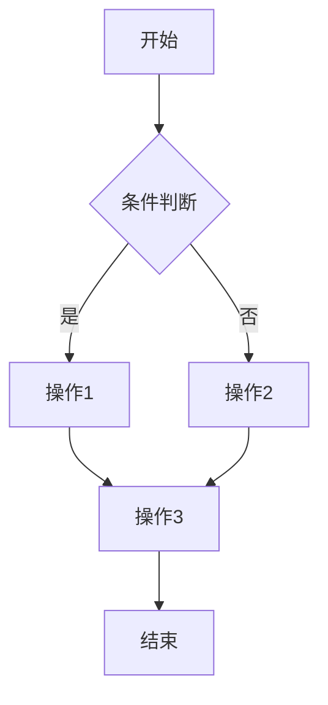
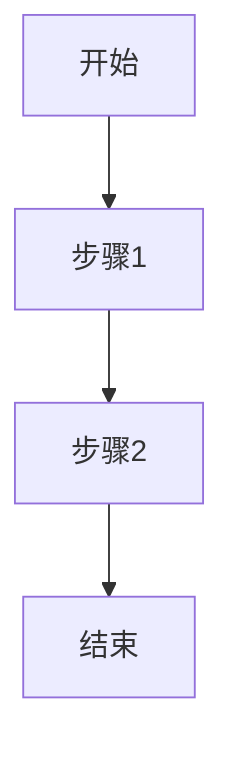

# （在此填写系统名称）

## 应用场景

<!-- 请描述你的系统所面向的应用场景，包括：
     - 系统解决什么问题
     - 面向哪些类型的用户
     - 核心业务是什么
     建议不少于100字 -->

（在此填写应用场景描述）

## 功能列表

<!-- 请用表格列出所有核心功能。功能名称要具体，简述要说明该功能做什么。
     至少列出8个核心功能（与核心实体数量对应）。 -->

| 功能名称 | 功能简述 |
|---------|---------|
| （功能1名称） | （功能1简述） |
| （功能2名称） | （功能2简述） |
| （功能3名称） | （功能3简述） |
| （功能4名称） | （功能4简述） |
| （功能5名称） | （功能5简述） |
| （功能6名称） | （功能6简述） |
| （功能7名称） | （功能7简述） |
| （功能8名称） | （功能8简述） |

## 核心业务流程

<!-- 从上面的功能列表中选择至少5项核心功能，逐一给出：
     1. 该功能的Mermaid流程图（必须使用 ```mermaid 代码块）
     2. 对应的文字描述

     流程图建议使用 flowchart LR 或 flowchart TD 语法。
     每个流程图应包含：开始/结束节点、判断节点、关键操作步骤。 -->

### 功能1：（功能名称）

<!-- 以下是一个Mermaid流程图示例，请替换为你的实际流程 -->



**文字描述**：（在此描述该流程的具体步骤和业务逻辑）

### 功能2：（功能名称）



**文字描述**：（在此描述）

### 功能3：（功能名称）


**文字描述**：（在此描述）

### 功能4：（功能名称）


**文字描述**：（在此描述）

### 功能5：（功能名称）


**文字描述**：（在此描述）
