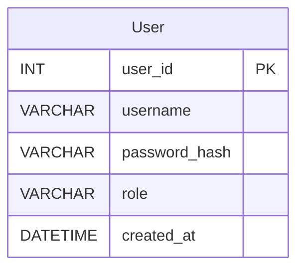

# （系统名称）数据库设计文档

## 第一部分：概念模型（ER图）

<!-- 使用 Mermaid erDiagram 语法绘制ER图。
     要求：
     - 实体数量 ≥ 8个
     - 包含至少1个多对多关系
     - 每个实体标注主键（PK）
     - 每个实体至少有2-3个属性
     - 必须使用 ```mermaid 代码块

     语法参考：
     实体定义：
       ENTITY_NAME {
         type attribute_name PK
         type attribute_name
       }
     关系定义：
       A ||--o{ B : "关系描述"    (一对多)
       A }o--o{ B : "关系描述"    (多对多)
-->



## 第二部分：逻辑模型（关系模式与数据字典）

<!-- 为ER图中的每个实体（表）制作数据字典。
     表头必须严格为5列：属性名称 | 属性域（类型及长度） | 是否允许为空 | 默认值 | 完整性约束说明
     每个表都要有对应的数据字典。 -->

### User（用户表）

| 属性名称 | 属性域（类型及长度） | 是否允许为空 | 默认值 | 完整性约束说明 |
|---------|-------------------|------------|--------|--------------|
| user_id | INT | 否 | 无 | 主键 |
| username | VARCHAR(50) | 否 | 无 | 唯一 |
| password_hash | VARCHAR(128) | 否 | 无 | 非空 |
| role | VARCHAR(10) | 否 | 'user' | CHECK(role IN ('admin','user')) |
| created_at | TIMESTAMP | 否 | CURRENT_TIMESTAMP | 非空 |

### （表名2）

| 属性名称 | 属性域（类型及长度） | 是否允许为空 | 默认值 | 完整性约束说明 |
|---------|-------------------|------------|--------|--------------|
| | | | | |

### （表名3）

| 属性名称 | 属性域（类型及长度） | 是否允许为空 | 默认值 | 完整性约束说明 |
|---------|-------------------|------------|--------|--------------|
| | | | | |

### （表名4）

| 属性名称 | 属性域（类型及长度） | 是否允许为空 | 默认值 | 完整性约束说明 |
|---------|-------------------|------------|--------|--------------|
| | | | | |

### （表名5）

| 属性名称 | 属性域（类型及长度） | 是否允许为空 | 默认值 | 完整性约束说明 |
|---------|-------------------|------------|--------|--------------|
| | | | | |

### （表名6）

| 属性名称 | 属性域（类型及长度） | 是否允许为空 | 默认值 | 完整性约束说明 |
|---------|-------------------|------------|--------|--------------|
| | | | | |

### （表名7）

| 属性名称 | 属性域（类型及长度） | 是否允许为空 | 默认值 | 完整性约束说明 |
|---------|-------------------|------------|--------|--------------|
| | | | | |

### （表名8）

| 属性名称 | 属性域（类型及长度） | 是否允许为空 | 默认值 | 完整性约束说明 |
|---------|-------------------|------------|--------|--------------|
| | | | | |

<!-- 如果有多对多关系的中间表，也要列出数据字典 -->

### （中间表名，如有）

| 属性名称 | 属性域（类型及长度） | 是否允许为空 | 默认值 | 完整性约束说明 |
|---------|-------------------|------------|--------|--------------|
| | | | | |

## 第三部分：物理模型（DDL 脚本）

<!-- 给出完整的 PostgreSQL DDL 脚本。
     要求：
     - 包含所有表的 CREATE TABLE 语句
     - 所有约束（主键、外键、唯一、非空、CHECK）在SQL中显式定义
     - 使用注释说明每个约束的用途
     - 语法须可被 PostgreSQL 成功解析
-->

```sql
-- ============================================
-- （系统名称）数据库DDL脚本
-- 目标数据库：PostgreSQL
-- ============================================

-- 用户表
CREATE TABLE User (
    user_id      SERIAL PRIMARY KEY,          -- 主键，自增
    username     VARCHAR(50) NOT NULL,         -- 用户名，非空
    password_hash VARCHAR(128) NOT NULL,       -- 密码哈希，非空
    role         VARCHAR(10) NOT NULL DEFAULT 'user'  -- 角色，默认user
                 CHECK (role IN ('admin', 'user')),    -- 角色约束
    created_at   TIMESTAMP NOT NULL DEFAULT CURRENT_TIMESTAMP,  -- 创建时间
    CONSTRAINT uk_user_username UNIQUE (username)      -- 用户名唯一
);

-- （请继续添加其余表的CREATE TABLE语句...）
```
