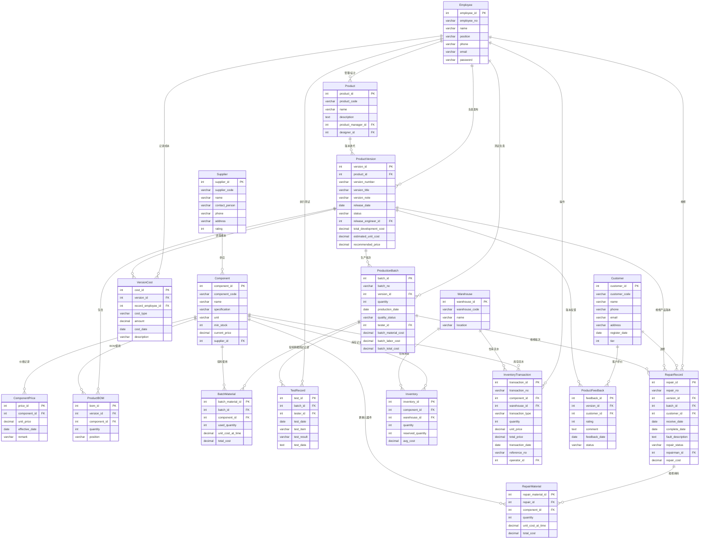

# 硬件产品全生命周期管理系统（HPLM）数据库设计文档

## 第一部分：概念模型（ER图）



## 第二部分：逻辑模型（关系模式与数据字典）

### Component（元器件表）

| 属性名称           | 属性域（类型及长度）    | 是否允许为空 | 默认值  | 完整性约束说明                     |
| -------------- | ------------- | ------ | ---- | --------------------------- |
| component_id   | INT           | 否      | 无    | 主键，自增                       |
| component_code | VARCHAR(50)   | 否      | 无    | 元器件编码，唯一约束                  |
| name           | VARCHAR(100)  | 否      | 无    | 元器件名称，非空                    |
| specification  | VARCHAR(200)  | 是      | NULL | 规格型号                        |
| unit           | VARCHAR(20)   | 否      | '个'  | 计量单位                        |
| min_stock      | INT           | 否      | 0    | 最低库存预警值，CHECK(min_stock>=0) |
| current_price  | DECIMAL(10,2) | 是      | NULL | 当前采购价格                      |
| supplier_id    | INT           | 是      | NULL | 外键，关联Supplier表              |

### ComponentPrice（元器件历史价格表）

| 属性名称           | 属性域（类型及长度）    | 是否允许为空 | 默认值          | 完整性约束说明         |
| -------------- | ------------- | ------ | ------------ | --------------- |
| price_id       | INT           | 否      | 无            | 主键，自增           |
| component_id   | INT           | 否      | 无            | 外键，关联Component表 |
| unit_price     | DECIMAL(10,2) | 否      | 无            | 历史单价，非空         |
| effective_date | DATE          | 否      | CURRENT_DATE | 生效日期            |
| remark         | VARCHAR(200)  | 是      | NULL         | 备注说明            |

### Supplier（供应商表）

| 属性名称           | 属性域（类型及长度）   | 是否允许为空 | 默认值  | 完整性约束说明                                |
| -------------- | ------------ | ------ | ---- | -------------------------------------- |
| supplier_id    | INT          | 否      | 无    | 主键，自增                                  |
| supplier_code  | VARCHAR(50)  | 否      | 无    | 供应商编码，唯一约束                             |
| name           | VARCHAR(100) | 否      | 无    | 供应商名称，非空                               |
| contact_person | VARCHAR(50)  | 是      | NULL | 联系人                                    |
| phone          | VARCHAR(20)  | 是      | NULL | 联系电话                                   |
| address        | VARCHAR(200) | 是      | NULL | 地址                                     |
| rating         | INT          | 否      | 3    | 供应商评级1-5，CHECK(rating BETWEEN 1 AND 5) |

### Product（产品表）

| 属性名称               | 属性域（类型及长度）   | 是否允许为空 | 默认值  | 完整性约束说明              |
| ------------------ | ------------ | ------ | ---- | -------------------- |
| product_id         | INT          | 否      | 无    | 主键，自增                |
| product_code       | VARCHAR(50)  | 否      | 无    | 产品编码，唯一约束            |
| name               | VARCHAR(100) | 否      | 无    | 产品名称，非空              |
| description        | TEXT         | 是      | NULL | 产品描述                 |
| product_manager_id | INT          | 是      | NULL | 外键，关联Employee表，产品经理  |
| designer_id        | INT          | 是      | NULL | 外键，关联Employee表，研发负责人 |

### ProductVersion（产品版本表）

| 属性名称                   | 属性域（类型及长度）    | 是否允许为空 | 默认值     | 完整性约束说明                                         |
| ---------------------- | ------------- | ------ | ------- | ----------------------------------------------- |
| version_id             | INT           | 否      | 无       | 主键，自增                                           |
| product_id             | INT           | 否      | 无       | 外键，关联Product表                                   |
| version_number         | VARCHAR(20)   | 否      | 无       | 版本号（如v1.0.0），唯一联合约束(product_id, version_number) |
| version_title          | VARCHAR(100)  | 是      | NULL    | 版本标题                                            |
| version_note           | TEXT          | 是      | NULL    | 版本注解说明                                          |
| release_date           | DATE          | 是      | NULL    | 发布日期                                            |
| status                 | VARCHAR(20)   | 否      | 'draft' | 状态（draft/released/deprecated），CHECK约束           |
| release_engineer_id    | INT           | 是      | NULL    | 外键，关联Employee表，发布工程师                            |
| total_development_cost | DECIMAL(12,2) | 否      | 0       | 累计研发成本                                          |
| estimated_unit_cost    | DECIMAL(10,2) | 是      | NULL    | 预估单台生产成本                                        |
| recommended_price      | DECIMAL(10,2) | 是      | NULL    | 建议上市售价                                          |

### VersionCost（版本研发成本明细表）

| 属性名称               | 属性域（类型及长度）    | 是否允许为空 | 默认值          | 完整性约束说明               |
| ------------------ | ------------- | ------ | ------------ | --------------------- |
| cost_id            | INT           | 否      | 无            | 主键，自增                 |
| version_id         | INT           | 否      | 无            | 外键，关联ProductVersion表  |
| record_employee_id | INT           | 否      | 无            | 外键，关联Employee表，记录人    |
| cost_type          | VARCHAR(50)   | 否      | 无            | 成本类型（人力/模具/测试/认证等）    |
| amount             | DECIMAL(12,2) | 否      | 无            | 金额，非负CHECK(amount>=0) |
| cost_date          | DATE          | 否      | CURRENT_DATE | 发生日期                  |
| description        | VARCHAR(200)  | 是      | NULL         | 费用说明                  |

### ProductBOM（产品BOM表）

| 属性名称         | 属性域（类型及长度）  | 是否允许为空 | 默认值  | 完整性约束说明              |
| ------------ | ----------- | ------ | ---- | -------------------- |
| bom_id       | INT         | 否      | 无    | 主键，自增                |
| version_id   | INT         | 否      | 无    | 外键，关联ProductVersion表 |
| component_id | INT         | 否      | 无    | 外键，关联Component表      |
| quantity     | INT         | 否      | 1    | 用量，CHECK(quantity>0) |
| position     | VARCHAR(500) | 是      | NULL | 元器件在PCB上的位置          |

### ProductionBatch（生产批次表）

| 属性名称                | 属性域（类型及长度）    | 是否允许为空 | 默认值          | 完整性约束说明                                          |
| ------------------- | ------------- | ------ | ------------ | ------------------------------------------------ |
| batch_id            | INT           | 否      | 无            | 主键，自增                                            |
| batch_no            | VARCHAR(50)   | 否      | 无            | 批次号，唯一约束                                         |
| version_id          | INT           | 否      | 无            | 外键，关联ProductVersion表                             |
| quantity            | INT           | 否      | 无            | 投产数量，CHECK(quantity>0)                           |
| production_date     | DATE          | 否      | CURRENT_DATE | 生产日期                                             |
| tester_id           | INT           | 是      | NULL         | 外键，关联Employee表，测试负责人                             |
| quality_status      | VARCHAR(20)   | 否      | 'pending'    | 质量状态（pending/qualified/defective/rework），CHECK约束 |
| batch_material_cost | DECIMAL(12,2) | 是      | NULL         | 批次物料成本                                           |
| batch_labor_cost    | DECIMAL(12,2) | 否      | 0            | 批次人工成本                                           |
| batch_total_cost    | DECIMAL(12,2) | 是      | NULL         | 批次总成本                                            |

### BatchMaterial（批次投料表）

| 属性名称              | 属性域（类型及长度）    | 是否允许为空 | 默认值 | 完整性约束说明                                         |
| ----------------- | ------------- | ------ | --- | ----------------------------------------------- |
| batch_material_id | INT           | 否      | 无   | 主键，自增                                           |
| batch_id          | INT           | 否      | 无   | 外键，关联ProductionBatch表                           |
| component_id      | INT           | 否      | 无   | 外键，关联Component表                                 |
| used_quantity     | INT           | 否      | 无   | 使用数量，CHECK(used_quantity>0)                     |
| unit_cost_at_time | DECIMAL(10,2) | 否      | 无   | 用料时的单价，非空                                       |
| total_cost        | DECIMAL(12,2) | 否      | 无   | 自动计算列(used_quantity × unit_cost_at_time)，STORED |

### TestRecord（测试记录表）

| 属性名称        | 属性域（类型及长度）   | 是否允许为空 | 默认值          | 完整性约束说明                        |
| ----------- | ------------ | ------ | ------------ | ------------------------------ |
| test_id     | INT          | 否      | 无            | 主键，自增                          |
| batch_id    | INT          | 否      | 无            | 外键，关联ProductionBatch表          |
| tester_id   | INT          | 否      | 无            | 外键，关联Employee表                 |
| test_date   | DATE         | 否      | CURRENT_DATE | 测试日期                           |
| test_item   | VARCHAR(100) | 否      | 无            | 测试项目名称                         |
| test_result | VARCHAR(20)  | 否      | 无            | 测试结果（pass/fail/retest），CHECK约束 |
| test_data   | TEXT         | 是      | NULL         | 详细测试数据（JSON格式）                 |

### RepairRecord（维修记录表）

| 属性名称              | 属性域（类型及长度）    | 是否允许为空 | 默认值          | 完整性约束说明                                             |
| ----------------- | ------------- | ------ | ------------ | --------------------------------------------------- |
| repair_id         | INT           | 否      | 无            | 主键，自增                                               |
| repair_no         | VARCHAR(50)   | 否      | 无            | 维修单号，唯一约束                                           |
| version_id        | INT           | 否      | 无            | 外键，关联ProductVersion表                                |
| batch_id          | INT           | 是      | NULL         | 外键，关联ProductionBatch表，精确记录故障产品所属批次（可为空）          |
| customer_id       | INT           | 否      | 无            | 外键，关联Customer表                                      |
| receive_date      | DATE          | 否      | CURRENT_DATE | 接修日期                                                |
| complete_date     | DATE          | 是      | NULL         | 完成日期                                                |
| fault_description | TEXT          | 否      | 无            | 故障描述                                                |
| repair_status     | VARCHAR(20)   | 否      | 'received'   | 维修状态（received/in_progress/completed/closed），CHECK约束 |
| repairman_id      | INT           | 是      | NULL         | 外键，关联Employee表，维修工程师                                |
| repair_cost       | DECIMAL(10,2) | 否      | 0            | 维修总费用，CHECK(repair_cost>=0)                         |

### RepairMaterial（维修用料表）

| 属性名称               | 属性域（类型及长度）    | 是否允许为空 | 默认值 | 完整性约束说明                                    |
| ------------------ | ------------- | ------ | --- | ------------------------------------------ |
| repair_material_id | INT           | 否      | 无   | 主键，自增                                      |
| repair_id          | INT           | 否      | 无   | 外键，关联RepairRecord表                         |
| component_id       | INT           | 否      | 无   | 外键，关联Component表                            |
| quantity           | INT           | 否      | 1   | 更换数量，CHECK(quantity>0)                     |
| unit_cost_at_time  | DECIMAL(10,2) | 否      | 无   | 更换时的单价                                     |
| total_cost         | DECIMAL(12,2) | 否      | 无   | 自动计算列(quantity × unit_cost_at_time)，STORED |

### Warehouse（仓库表）

| 属性名称           | 属性域（类型及长度）   | 是否允许为空 | 默认值  | 完整性约束说明   |
| -------------- | ------------ | ------ | ---- | --------- |
| warehouse_id   | INT          | 否      | 无    | 主键，自增     |
| warehouse_code | VARCHAR(50)  | 否      | 无    | 仓库编码，唯一约束 |
| name           | VARCHAR(100) | 否      | 无    | 仓库名称，非空   |
| location       | VARCHAR(200) | 是      | NULL | 仓库位置      |

### Inventory（库存表）

| 属性名称              | 属性域（类型及长度）    | 是否允许为空 | 默认值  | 完整性约束说明                                            |
| ----------------- | ------------- | ------ | ---- | -------------------------------------------------- |
| inventory_id      | INT           | 否      | 无    | 主键，自增                                              |
| component_id      | INT           | 否      | 无    | 外键，关联Component表，唯一联合约束(component_id, warehouse_id) |
| warehouse_id      | INT           | 否      | 无    | 外键，关联Warehouse表                                    |
| quantity          | INT           | 否      | 0    | 当前库存量，CHECK(quantity>=0)                           |
| reserved_quantity | INT           | 否      | 0    | 预留/锁定数量，CHECK(reserved_quantity>=0)                |
| avg_cost          | DECIMAL(10,2) | 是      | NULL | 移动平均成本                                             |

### InventoryTransaction（库存流水表）

| 属性名称             | 属性域（类型及长度）    | 是否允许为空 | 默认值          | 完整性约束说明                              |
| ---------------- | ------------- | ------ | ------------ | ------------------------------------ |
| transaction_id   | INT           | 否      | 无            | 主键，自增                                |
| transaction_no   | VARCHAR(50)   | 否      | 无            | 流水单号，唯一约束                            |
| component_id     | INT           | 否      | 无            | 外键，关联Component表                      |
| warehouse_id     | INT           | 否      | 无            | 外键，关联Warehouse表                      |
| transaction_type | VARCHAR(20)   | 否      | 无            | 交易类型（in/out/return/transfer），CHECK约束 |
| quantity         | INT           | 否      | 无            | 数量，非零CHECK(quantity<>0)              |
| unit_price       | DECIMAL(10,2) | 是      | NULL         | 交易单价                                 |
| total_price      | DECIMAL(12,2) | 是      | NULL         | 交易总价                                 |
| transaction_date | DATE          | 否      | CURRENT_DATE | 交易日期                                 |
| reference_no     | VARCHAR(50)   | 是      | NULL         | 关联单号（采购单/生产单等）                       |
| operator_id      | INT           | 否      | 无            | 外键，关联Employee表，操作人                   |

### Employee（员工表）

| 属性名称        | 属性域（类型及长度）   | 是否允许为空 | 默认值  | 完整性约束说明                |
| ----------- | ------------ | ------ | ---- | ---------------------- |
| employee_id | INT          | 否      | 无    | 主键，自增                  |
| employee_no | VARCHAR(50)  | 否      | 无    | 工号，唯一约束                |
| name        | VARCHAR(50)  | 否      | 无    | 姓名，非空                  |
| position    | VARCHAR(50)  | 否      | 无    | 职位（BOSS/项目经理/研发者/测试者等） |
| phone       | VARCHAR(20)  | 是      | NULL | 联系电话                   |
| email       | VARCHAR(100) | 是      | NULL | 邮箱，唯一约束                |
| password    | VARCHAR(64)  | 否      | 无    | 登录密码哈希值（如SHA-256），非空   |

### Customer（客户表）

| 属性名称          | 属性域（类型及长度）   | 是否允许为空 | 默认值          | 完整性约束说明                             |
| ------------- | ------------ | ------ | ------------ | ----------------------------------- |
| customer_id   | INT          | 否      | 无            | 主键，自增                               |
| customer_code | VARCHAR(50)  | 否      | 无            | 客户编码，唯一约束                           |
| name          | VARCHAR(100) | 否      | 无            | 客户名称，非空                             |
| phone         | VARCHAR(20)  | 是      | NULL         | 联系电话                                |
| email         | VARCHAR(100) | 是      | NULL         | 邮箱                                  |
| address       | VARCHAR(200) | 是      | NULL         | 地址                                  |
| register_date | DATE         | 否      | CURRENT_DATE | 注册日期                                |
| tier          | INT          | 否      | 1            | 客户等级1-5，CHECK(tier BETWEEN 1 AND 5) |

### ProductFeedback（产品反馈评价表）

| 属性名称          | 属性域（类型及长度）  | 是否允许为空 | 默认值          | 完整性约束说明                               |
| ------------- | ----------- | ------ | ------------ | ------------------------------------- |
| feedback_id   | INT         | 否      | 无            | 主键，自增                                 |
| version_id    | INT         | 否      | 无            | 外键，关联ProductVersion表                  |
| customer_id   | INT         | 否      | 无            | 外键，关联Customer表                        |
| rating        | INT         | 否      | 无            | 评分1-5，CHECK(rating BETWEEN 1 AND 5)   |
| comment       | TEXT        | 是      | NULL         | 评价内容                                  |
| feedback_date | DATE        | 否      | CURRENT_DATE | 评价日期                                  |
| status        | VARCHAR(20) | 否      | 'pending'    | 状态（pending/approved/rejected），CHECK约束 |

## 第三部分：物理模型（DDL脚本）

```sql
-- ============================================
-- 硬件产品全生命周期管理系统（HPLM）数据库DDL脚本
-- 目标数据库：PostgreSQL 14+
-- 创建时间：2026年6月
-- ============================================

-- 启用UUID扩展（如需）
-- CREATE EXTENSION IF NOT EXISTS "uuid-ossp";

-- ============================================
-- 1. 供应商表
-- ============================================
CREATE TABLE Supplier (
    supplier_id     SERIAL PRIMARY KEY,
    supplier_code   VARCHAR(50) NOT NULL UNIQUE,        -- 供应商编码，唯一
    name            VARCHAR(100) NOT NULL,               -- 供应商名称
    contact_person  VARCHAR(50),                         -- 联系人
    phone           VARCHAR(20),                         -- 联系电话
    address         VARCHAR(200),                        -- 地址
    rating          INT NOT NULL DEFAULT 3               -- 评级1-5
                    CHECK (rating BETWEEN 1 AND 5)
);

COMMENT ON TABLE Supplier IS '供应商信息表';
COMMENT ON COLUMN Supplier.supplier_code IS '供应商编码，唯一标识';
COMMENT ON COLUMN Supplier.rating IS '供应商评级，1-5分';

-- ============================================
-- 2. 员工表
-- ============================================
CREATE TABLE Employee (
    employee_id     SERIAL PRIMARY KEY,
    employee_no     VARCHAR(50) NOT NULL UNIQUE,        -- 工号，唯一
    name            VARCHAR(50) NOT NULL,                -- 姓名
    password        VARCHAR(64) NOT NULL,                -- 登录密码哈希值（SHA-256），非空
    position        VARCHAR(50) NOT NULL,                -- 职位（BOSS/项目经理/研发者/测试者）
    phone           VARCHAR(20),                         -- 联系电话
    email           VARCHAR(100) UNIQUE                  -- 邮箱，唯一
);

COMMENT ON TABLE Employee IS '员工信息表';
COMMENT ON COLUMN Employee.position IS '职位：BOSS、项目经理、研发者、测试者等';

-- ============================================
-- 3. 客户表
-- ============================================
CREATE TABLE Customer (
    customer_id     SERIAL PRIMARY KEY,
    customer_code   VARCHAR(50) NOT NULL UNIQUE,        -- 客户编码，唯一
    name            VARCHAR(100) NOT NULL,               -- 客户名称
    phone           VARCHAR(20),                         -- 联系电话
    email           VARCHAR(100),                        -- 邮箱
    address         VARCHAR(200),                        -- 地址
    register_date   DATE NOT NULL DEFAULT CURRENT_DATE, -- 注册日期
    tier            INT NOT NULL DEFAULT 1               -- 客户等级1-5
                    CHECK (tier BETWEEN 1 AND 5)
);

COMMENT ON TABLE Customer IS '客户信息表';
COMMENT ON COLUMN Customer.tier IS '客户等级，1-5级';

-- ============================================
-- 4. 产品表
-- ============================================
CREATE TABLE Product (
    product_id          SERIAL PRIMARY KEY,
    product_code        VARCHAR(50) NOT NULL UNIQUE,    -- 产品编码，唯一
    name                VARCHAR(100) NOT NULL,           -- 产品名称
    description         TEXT,                            -- 产品描述
    product_manager_id  INT REFERENCES Employee(employee_id) ON DELETE SET NULL,  -- 产品经理
    designer_id         INT REFERENCES Employee(employee_id) ON DELETE SET NULL   -- 研发负责人
);

COMMENT ON TABLE Product IS '产品主表';
COMMENT ON COLUMN Product.product_manager_id IS '外键，关联产品经理';
COMMENT ON COLUMN Product.designer_id IS '外键，关联研发负责人';

-- ============================================
-- 5. 产品版本表
-- ============================================
CREATE TABLE ProductVersion (
    version_id              SERIAL PRIMARY KEY,
    product_id              INT NOT NULL REFERENCES Product(product_id) ON DELETE CASCADE,
    version_number          VARCHAR(20) NOT NULL,        -- 版本号，如v1.0.0
    version_title           VARCHAR(100),                -- 版本标题
    version_note            TEXT,                        -- 版本注解说明
    release_date            DATE,                        -- 发布日期
    status                  VARCHAR(20) NOT NULL DEFAULT 'draft'
                            CHECK (status IN ('draft', 'released', 'deprecated')),
    release_engineer_id     INT REFERENCES Employee(employee_id) ON DELETE SET NULL,
    total_development_cost  DECIMAL(12,2) NOT NULL DEFAULT 0 CHECK (total_development_cost >= 0),
    estimated_unit_cost     DECIMAL(10,2),               -- 预估单台成本
    recommended_price       DECIMAL(10,2),               -- 建议售价
    UNIQUE(product_id, version_number)                   -- 同一产品下版本号唯一
);

COMMENT ON TABLE ProductVersion IS '产品版本表，支持多版本管理';
COMMENT ON COLUMN ProductVersion.version_number IS '版本号，如v1.0、v2.0';
COMMENT ON COLUMN ProductVersion.version_note IS '版本注解，类似Git commit message';
COMMENT ON COLUMN ProductVersion.status IS '版本状态：draft草稿/released已发布/deprecated废弃';

-- ============================================
-- 6. 版本研发成本明细表
-- ============================================
CREATE TABLE VersionCost (
    cost_id             SERIAL PRIMARY KEY,
    version_id          INT NOT NULL REFERENCES ProductVersion(version_id) ON DELETE CASCADE,
    record_employee_id  INT NOT NULL REFERENCES Employee(employee_id),
    cost_type           VARCHAR(50) NOT NULL,            -- 成本类型：人力/模具/测试/认证
    amount              DECIMAL(12,2) NOT NULL CHECK (amount >= 0),
    cost_date           DATE NOT NULL DEFAULT CURRENT_DATE,
    description         VARCHAR(200)
);

COMMENT ON TABLE VersionCost IS '产品版本研发成本明细';
COMMENT ON COLUMN VersionCost.cost_type IS '成本类型：人力成本、模具费、测试费、认证费等';

-- ============================================
-- 7. 元器件表
-- ============================================
CREATE TABLE Component (
    component_id    SERIAL PRIMARY KEY,
    component_code  VARCHAR(50) NOT NULL UNIQUE,        -- 元器件编码，唯一
    name            VARCHAR(100) NOT NULL,               -- 元器件名称
    specification   VARCHAR(200),                        -- 规格型号
    unit            VARCHAR(20) NOT NULL DEFAULT '个',   -- 计量单位
    min_stock       INT NOT NULL DEFAULT 0 CHECK (min_stock >= 0),  -- 最低库存预警值
    current_price   DECIMAL(10,2),                       -- 当前采购价格
    supplier_id     INT REFERENCES Supplier(supplier_id) ON DELETE SET NULL  -- 主要供应商
);

COMMENT ON TABLE Component IS '元器件物料表';
COMMENT ON COLUMN Component.min_stock IS '最低库存阈值，低于此值触发预警';
COMMENT ON COLUMN Component.current_price IS '当前采购价格';

-- ============================================
-- 8. 元器件历史价格表
-- ============================================
CREATE TABLE ComponentPrice (
    price_id        SERIAL PRIMARY KEY,
    component_id    INT NOT NULL REFERENCES Component(component_id) ON DELETE CASCADE,
    unit_price      DECIMAL(10,2) NOT NULL,
    effective_date  DATE NOT NULL DEFAULT CURRENT_DATE,
    remark          VARCHAR(200)
);

COMMENT ON TABLE ComponentPrice IS '元器件历史采购价格记录';
COMMENT ON COLUMN ComponentPrice.effective_date IS '价格生效日期';

-- ============================================
-- 9. 仓库表
-- ============================================
CREATE TABLE Warehouse (
    warehouse_id    SERIAL PRIMARY KEY,
    warehouse_code  VARCHAR(50) NOT NULL UNIQUE,        -- 仓库编码，唯一
    name            VARCHAR(100) NOT NULL,               -- 仓库名称
    location        VARCHAR(200)                         -- 位置描述
);

COMMENT ON TABLE Warehouse IS '仓库信息表';

-- ============================================
-- 10. 库存表
-- ============================================
CREATE TABLE Inventory (
    inventory_id        SERIAL PRIMARY KEY,
    component_id        INT NOT NULL REFERENCES Component(component_id) ON DELETE CASCADE,
    warehouse_id        INT NOT NULL REFERENCES Warehouse(warehouse_id) ON DELETE CASCADE,
    quantity            INT NOT NULL DEFAULT 0 CHECK (quantity >= 0),
    reserved_quantity   INT NOT NULL DEFAULT 0 CHECK (reserved_quantity >= 0),
    avg_cost            DECIMAL(10,2),                   -- 移动平均成本
    UNIQUE(component_id, warehouse_id)                   -- 同一元器件在同一仓库唯一
);

COMMENT ON TABLE Inventory IS '元器件库存表';
COMMENT ON COLUMN Inventory.reserved_quantity IS '已锁定/预留数量';
COMMENT ON COLUMN Inventory.avg_cost IS '移动平均成本，用于库存计价';

-- ============================================
-- 11. 库存流水表
-- ============================================
CREATE TABLE InventoryTransaction (
    transaction_id     SERIAL PRIMARY KEY,
    transaction_no     VARCHAR(50) NOT NULL UNIQUE,      -- 流水单号，唯一
    component_id       INT NOT NULL REFERENCES Component(component_id),
    warehouse_id       INT NOT NULL REFERENCES Warehouse(warehouse_id),
    transaction_type   VARCHAR(20) NOT NULL
                       CHECK (transaction_type IN ('in', 'out', 'return', 'transfer')),
    quantity           INT NOT NULL CHECK (quantity <> 0),
    unit_price         DECIMAL(10,2),                    -- 交易单价
    total_price        DECIMAL(12,2),                    -- 交易总价
    transaction_date   DATE NOT NULL DEFAULT CURRENT_DATE,
    reference_no       VARCHAR(50),                      -- 关联单号（采购单/生产工单）
    operator_id        INT NOT NULL REFERENCES Employee(employee_id)
);

COMMENT ON TABLE InventoryTransaction IS '库存流水明细表';
COMMENT ON COLUMN InventoryTransaction.transaction_type IS '交易类型：in入库/out出库/return退货/transfer调拨';
COMMENT ON COLUMN InventoryTransaction.reference_no IS '关联的外部单号，用于追溯来源';

-- ============================================
-- 12. 产品BOM表
-- ============================================
CREATE TABLE ProductBOM (
    bom_id          SERIAL PRIMARY KEY,
    version_id      INT NOT NULL REFERENCES ProductVersion(version_id) ON DELETE CASCADE,
    component_id    INT NOT NULL REFERENCES Component(component_id) ON DELETE RESTRICT,
    quantity        INT NOT NULL DEFAULT 1 CHECK (quantity > 0),
    position        VARCHAR(500),                         -- PCB位置编号
    UNIQUE(version_id, component_id)                     -- 同一版本下元器件不重复
);

COMMENT ON TABLE ProductBOM IS '产品BOM物料清单';
COMMENT ON COLUMN ProductBOM.position IS '元器件在PCB板上的位置编号';

-- ============================================
-- 13. 生产批次表
-- ============================================
CREATE TABLE ProductionBatch (
    batch_id            SERIAL PRIMARY KEY,
    batch_no            VARCHAR(50) NOT NULL UNIQUE,     -- 批次号，唯一
    version_id          INT NOT NULL REFERENCES ProductVersion(version_id),
    quantity            INT NOT NULL CHECK (quantity > 0),
    production_date     DATE NOT NULL DEFAULT CURRENT_DATE,
    tester_id           INT REFERENCES Employee(employee_id) ON DELETE SET NULL,
    quality_status      VARCHAR(20) NOT NULL DEFAULT 'pending'
                        CHECK (quality_status IN ('pending', 'qualified', 'defective', 'rework')),
    batch_material_cost DECIMAL(12,2),                   -- 批次物料总成本
    batch_labor_cost    DECIMAL(12,2) NOT NULL DEFAULT 0 CHECK (batch_labor_cost >= 0),
    batch_total_cost    DECIMAL(12,2)                    -- 批次总成本
);

COMMENT ON TABLE ProductionBatch IS '产品生产批次表';
COMMENT ON COLUMN ProductionBatch.quality_status IS '质量状态：pending待检/qualified合格/defective不合格/rework返修';

-- ============================================
-- 14. 批次投料表
-- ============================================
CREATE TABLE BatchMaterial (
    batch_material_id   SERIAL PRIMARY KEY,
    batch_id            INT NOT NULL REFERENCES ProductionBatch(batch_id) ON DELETE CASCADE,
    component_id        INT NOT NULL REFERENCES Component(component_id) ON DELETE RESTRICT,
    used_quantity       INT NOT NULL CHECK (used_quantity > 0),
    unit_cost_at_time   DECIMAL(10,2) NOT NULL,          -- 用料时的单价
    total_cost          DECIMAL(12,2) GENERATED ALWAYS AS (used_quantity * unit_cost_at_time) STORED,  -- 自动计算
    UNIQUE(batch_id, component_id)
);

COMMENT ON TABLE BatchMaterial IS '生产批次投料明细，用于成本追溯';
COMMENT ON COLUMN BatchMaterial.unit_cost_at_time IS '用料时的元器件单价，取自库存平均成本';
COMMENT ON COLUMN BatchMaterial.total_cost IS '自动计算的该行物料总成本';

-- ============================================
-- 15. 测试记录表
-- ============================================
CREATE TABLE TestRecord (
    test_id         SERIAL PRIMARY KEY,
    batch_id        INT NOT NULL REFERENCES ProductionBatch(batch_id) ON DELETE CASCADE,
    tester_id       INT NOT NULL REFERENCES Employee(employee_id),
    test_date       DATE NOT NULL DEFAULT CURRENT_DATE,
    test_item       VARCHAR(100) NOT NULL,
    test_result     VARCHAR(20) NOT NULL
                    CHECK (test_result IN ('pass', 'fail', 'retest')),
    test_data       TEXT                                 -- JSON格式存储详细测试数据
);

COMMENT ON TABLE TestRecord IS '产品测试记录表';
COMMENT ON COLUMN TestRecord.test_data IS '详细的测试数据，可存储JSON格式';

-- ============================================
-- 16. 维修记录表
-- ============================================
CREATE TABLE RepairRecord (
    repair_id           SERIAL PRIMARY KEY,
    repair_no           VARCHAR(50) NOT NULL UNIQUE,     -- 维修单号，唯一
    version_id          INT NOT NULL REFERENCES ProductVersion(version_id),
    batch_id            INT REFERENCES ProductionBatch(batch_id) ON DELETE SET NULL,  -- 关联生产批次，精确溯源
    customer_id         INT NOT NULL REFERENCES Customer(customer_id),
    receive_date        DATE NOT NULL DEFAULT CURRENT_DATE,
    complete_date       DATE,
    fault_description   TEXT NOT NULL,
    repair_status       VARCHAR(20) NOT NULL DEFAULT 'received'
                        CHECK (repair_status IN ('received', 'in_progress', 'completed', 'closed')),
    repairman_id        INT REFERENCES Employee(employee_id) ON DELETE SET NULL,
    repair_cost         DECIMAL(10,2) NOT NULL DEFAULT 0 CHECK (repair_cost >= 0)
);

COMMENT ON TABLE RepairRecord IS '产品维修工单表';
COMMENT ON COLUMN RepairRecord.repair_status IS '维修状态：received已接修/in_progress维修中/completed已完成/closed关闭';

-- ============================================
-- 17. 维修用料表
-- ============================================
CREATE TABLE RepairMaterial (
    repair_material_id  SERIAL PRIMARY KEY,
    repair_id           INT NOT NULL REFERENCES RepairRecord(repair_id) ON DELETE CASCADE,
    component_id        INT NOT NULL REFERENCES Component(component_id) ON DELETE RESTRICT,
    quantity            INT NOT NULL CHECK (quantity > 0),
    unit_cost_at_time   DECIMAL(10,2) NOT NULL,
    total_cost          DECIMAL(12,2) GENERATED ALWAYS AS (quantity * unit_cost_at_time) STORED
);

COMMENT ON TABLE RepairMaterial IS '维修更换用料明细';
COMMENT ON COLUMN RepairMaterial.unit_cost_at_time IS '更换时的元器件单价';

-- ============================================
-- 18. 产品反馈评价表
-- ============================================
CREATE TABLE ProductFeedback (
    feedback_id     SERIAL PRIMARY KEY,
    version_id      INT NOT NULL REFERENCES ProductVersion(version_id) ON DELETE CASCADE,
    customer_id     INT NOT NULL REFERENCES Customer(customer_id) ON DELETE CASCADE,
    rating          INT NOT NULL CHECK (rating BETWEEN 1 AND 5),
    comment         TEXT,
    feedback_date   DATE NOT NULL DEFAULT CURRENT_DATE,
    status          VARCHAR(20) NOT NULL DEFAULT 'pending'
                    CHECK (status IN ('pending', 'approved', 'rejected')),
    UNIQUE(version_id, customer_id)                        -- 同一客户对同一版本只能评价一次
);

COMMENT ON TABLE ProductFeedback IS '客户产品评价反馈表';
COMMENT ON COLUMN ProductFeedback.rating IS '评分1-5星，1最低5最高';
COMMENT ON COLUMN ProductFeedback.status IS '评价状态：pending待审核/approved已通过/rejected已拒绝';

-- ============================================
-- 索引优化建议（提升查询性能）
-- ============================================

-- 产品版本查询索引
CREATE INDEX idx_product_version_product ON ProductVersion(product_id);
CREATE INDEX idx_product_version_status ON ProductVersion(status);

-- 批次查询索引
CREATE INDEX idx_batch_version ON ProductionBatch(version_id);
CREATE INDEX idx_batch_quality ON ProductionBatch(quality_status);
CREATE INDEX idx_batch_date ON ProductionBatch(production_date);

-- 元器件查询索引
CREATE INDEX idx_component_supplier ON Component(supplier_id);
CREATE INDEX idx_component_code ON Component(component_code);

-- 库存流水查询索引
CREATE INDEX idx_inventory_transaction_component ON InventoryTransaction(component_id);
CREATE INDEX idx_inventory_transaction_date ON InventoryTransaction(transaction_date);
CREATE INDEX idx_inventory_transaction_type ON InventoryTransaction(transaction_type);

-- 维修记录查询索引
CREATE INDEX idx_repair_customer ON RepairRecord(customer_id);
CREATE INDEX idx_repair_version ON RepairRecord(version_id);
CREATE INDEX idx_repair_status ON RepairRecord(repair_status);
CREATE INDEX idx_repair_receive_date ON RepairRecord(receive_date);

-- 评价查询索引
CREATE INDEX idx_feedback_version ON ProductFeedback(version_id);
CREATE INDEX idx_feedback_rating ON ProductFeedback(rating);
CREATE INDEX idx_feedback_date ON ProductFeedback(feedback_date);

-- BOM查询索引
CREATE INDEX idx_bom_version ON ProductBOM(version_id);
CREATE INDEX idx_bom_component ON ProductBOM(component_id);

-- 批次投料查询索引
CREATE INDEX idx_batch_material_batch ON BatchMaterial(batch_id);
CREATE INDEX idx_batch_material_component ON BatchMaterial(component_id);

-- ============================================
-- 验证查询示例（用于测试）
-- ============================================

-- 示例1：故障产品溯源查询（通过batch_id精确定位批次）
-- SELECT pb.batch_no, c.component_code, c.name, s.name AS supplier
-- FROM RepairRecord r
-- LEFT JOIN ProductionBatch pb ON r.batch_id = pb.batch_id
-- LEFT JOIN BatchMaterial bm ON pb.batch_id = bm.batch_id
-- LEFT JOIN Component c ON bm.component_id = c.component_id
-- LEFT JOIN Supplier s ON c.supplier_id = s.supplier_id
-- WHERE r.repair_no = 'REP202600001';

-- 示例2：版本成本分析
-- SELECT pv.version_number, pv.total_development_cost, 
--        SUM(bm.used_quantity * bm.unit_cost_at_time) AS material_cost
-- FROM ProductVersion pv
-- LEFT JOIN ProductionBatch pb ON pv.version_id = pb.version_id
-- LEFT JOIN BatchMaterial bm ON pb.batch_id = bm.batch_id
-- GROUP BY pv.version_id;
```
